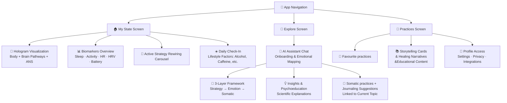

```mermaid
flowchart TD

%% App Structure Overview
A[🧩 App Navigation] --> B[🏠 My State Screen]
A --> C[💬 Explore Screen]
A --> D[🌸 Practices Screen]

%% My State Core Features
B --> B1[🔮 Hologram Visualization<br/>Body + Brain Pathways + ANS]
B --> B2[📊 Biomarkers Overview<br/>Sleep · Activity · HR · HRV · Battery]
B --> B3[🧬 Active Strategy Rewiring Carousel]
B --> B4[☀️ Daily Check-In<br/>Lifestyle Factors: Alcohol, Caffeine, etc.]

%% Explore Core Features
C --> C1[🤖 AI Assistant Chat<br/>Onboarding & Emotional Mapping]
C1 --> C2[🧠 3-Layer Framework<br/>Strategy → Emotion → Somatic]
C1--> C3[💡 Insights & Psychoeducation<br/>Scientific Explanations]
C1 --> C4[🪷 Somatic practices + Journaling Suggestions<br/>Linked to Current Topic]

%% Practices Core Features
D --> D1[🌿 Favourite practices]
D --> D2[📚 Storytelling Cards<br/> & Healing Narratives<br/> &Educational Content]
D --> D3[👤 Profile Access<br/>Settings · Privacy · Integrations]
```

